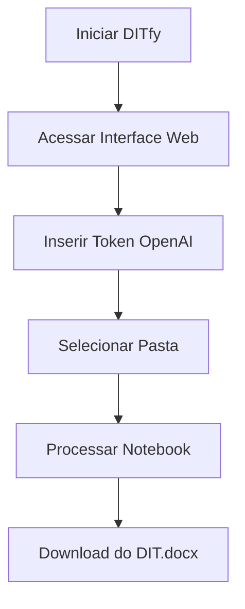

Claro! Aqui está o **manual atualizado** com todas as melhorias e sugestões aplicadas — incluindo: resumo executivo, pré-requisitos, exemplos de uso, seção sobre modo offline, instruções para uso em equipe e mais refinamentos para profissionalizar a entrega:

---

# 📘 **Manual do Usuário - DITfy (Conversor Jupyter para DIT)**

**Versão 2.0 com Interface Web**

---

## ✨ **Resumo Executivo**

**DITfy** é uma aplicação local com interface web que converte arquivos Jupyter Notebook (`.ipynb`) em Documentos Técnicos formatados (`.docx`), com auxílio da IA da OpenAI. Ideal para analistas, engenheiros de dados e cientistas que precisam gerar relatórios e documentações sem esforço, direto do seu ambiente local, com apenas alguns cliques.

---

## 🌟 **Novidades da Versão 2.0**

* ✅ Interface gráfica web, sem necessidade de terminal
* ✅ Processamento em um clique
* ✅ Navegação e seleção de arquivos local
* ✅ Download automático do DIT gerado
* ✅ Compatível com Windows (versão Linux em andamento)

---

## 📋 **Pré-Requisitos**

| Item                | Recomendado                  |
| ------------------- | ---------------------------- |
| Sistema Operacional | Windows 10/11 ou Linux (CLI) |
| Python              | 3.10 ou superior             |
| RAM mínima          | 4 GB                         |
| Internet            | Apenas para usar OpenAI API  |
| Conta OpenAI        | Chave de API necessária      |

---

## 🖥️ **Instalação**

### 🔧 Método Automático (Recomendado)

```bash
python installer.py
```

### 🛠️ Método Manual

```bash
python -m pip install -r requirements.txt
```

Depois, crie manualmente a estrutura de pastas:

```
project-root/
│
├── .venv/                      # Ambiente virtual
├── doc/                        # Documentos carregados
├── .env                        # Variáveis de ambiente
├── functions/                  # Funções do sistema   
│   ├── __init__.py             # Inicialização do módulo
│   ├── log.py                  # Configuração do logger 
│   ├── estrutura.py            # Criação de pastas
│   ├── conversao.py            # Conversão de arquivos
│   ├── upsert_key_gpt.py       # Inserção de chave da API OpenAI
│   ├── create_key_gpt.py       # Criação/atualização da chave da API OpenAI
│   ├── esta_em_venv.py         # Verificação do ambiente virtual
|   ├── garantir_venv.py        # Garantia do ambiente virtual        
├── log/                        # Logs do sistema
├── markdown/                   # Arquivos convertidos para Markdown
├── notebooks/                  # Notebooks Jupyter
├── docdit_app.exe              # Executável do sistema (se aplicável)
├── installer.py                # Script de instalação automática
└── README.md                   # 
```

---

## 🚀 **Como Iniciar**

### 🪟 Windows

```bash
ditfy.exe
```

### 🐧 Linux/Mac

```bash
python -m src.interface
```

> ⚠️ **Firewall:** Pode ser necessário permitir o acesso local na primeira execução.

---

## 🌐 **Acessando a Interface Web**

Abra seu navegador e digite:

```
http://127.0.0.1:7860
```

> 💡 Roda **localmente**, sem necessidade de internet (exceto OpenAI).

---

## 🖱️ **Passo a Passo na Interface**

### **1. Configuração Inicial**


*(Imagem ilustrativa)*

1. Clique em **"Criar Token OpenAI"** para acessar o site da OpenAI.
2. Copie e cole sua chave API no campo **"Token OpenAI"**.

### **2. Seleção de Arquivos**

* Use o botão **📁 Procurar** para navegar até a pasta com seus `.ipynb`.
* Ou cole o caminho da pasta manualmente.

### **3. Processamento**

* Clique em **⚙️ Processar**
* Acompanhe o status em tempo real no painel

### **4. Resultado**

* O documento será gerado automaticamente em `.docx`
* Um link de **download** será disponibilizado
* Em caso de erro, uma **mensagem explicativa** será exibida

---

## 💼 **Exemplos de Uso**

* 📊 Relatórios automáticos de análises exploratórias
* 📈 Documentações técnicas de projetos de dados
* 🗃️ Padronização de notebooks para repositórios internos
* 🤖 Geração de DITs com apoio de IA para apresentações executivas

---

## 🛠️ **Recursos Avançados**

### ⌨️ Teclas de Atalho

| Combinação     | Ação                |
| -------------- | ------------------- |
| `Ctrl + Enter` | Processar notebooks |
| `Esc`          | Limpar os campos    |

### 🗂️ Pastas Criadas

```
./notebooks/   - Cópia dos arquivos originais  
./markdown/    - Arquivos intermediários em Markdown  
./doc/         - Documento final gerado (DIT.docx)  
```

### 📄 Logs do Sistema

```
./log/ditfy.log
```

---

## 📡 **Modo Offline**

* A interface e a conversão de arquivos funcionam 100% localmente
* Apenas o uso da **API da OpenAI** exige internet

---

## 🧠 **Uso em Equipes / Ambiente Corporativo**

Você pode rodar o DITfy em um **servidor interno** e liberar o acesso pela rede:

1. Inicie o DITfy no servidor:

   ```bash
   ditfy.exe --port 7860
   ```
2. Acesse de outro computador pela rede:

   ```
   http://IP-do-servidor:7860
   ```
3. Configure autenticação/restrições via VPN ou firewall interno

---

## 🧩 **Solução de Problemas**

| Problema              | Solução                                                             |
| --------------------- | ------------------------------------------------------------------- |
| Erro 404 no navegador | Verifique se o `ditfy.exe` está em execução                         |
| Token não aceito      | Gere nova chave em [OpenAI Dashboard](https://platform.openai.com/) |
| Porta 7860 ocupada    | Execute com: `ditfy.exe --port 7870`                                |

---

## 🔄 **Fluxo Completo de Uso**



---

## 📞 **Suporte e Contato**

```bash
ditfy.exe --help
# ou
python -m src.interface --help
```

**Contato Técnico:**

* 📧 Email: [suporte@ditfy.com](mailto:suporte@ditfy.com)
* 💻 GitHub: [github.com/seurepo/issues](https://github.com/seurepo/issues)

---

> 💡 **Dica Profissional:** Compartilhe a ferramenta com sua equipe de dados! Você pode centralizar a documentação em um servidor local com acesso restrito.

---

[⬆ Voltar ao topo](#-manual-do-usuário---ditfy-conversor-jupyter-para-dit)

---

**Versão 2.0 — © 2025 — Interface Gradio por Michel Souza Santana**
 

---

